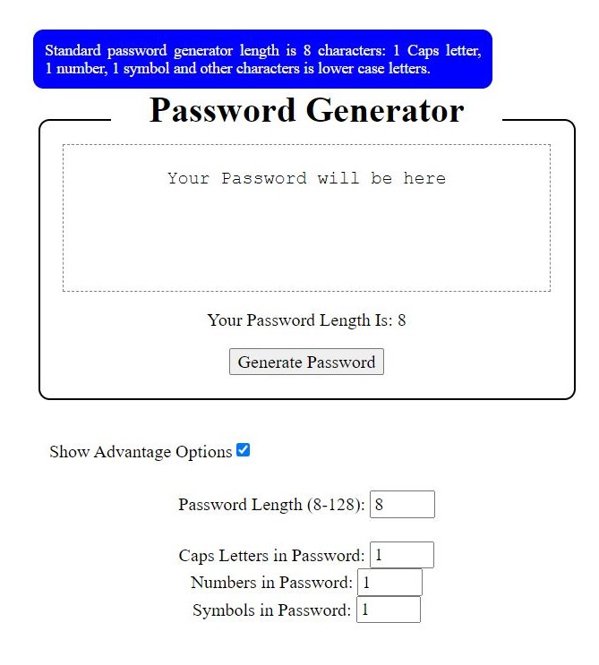
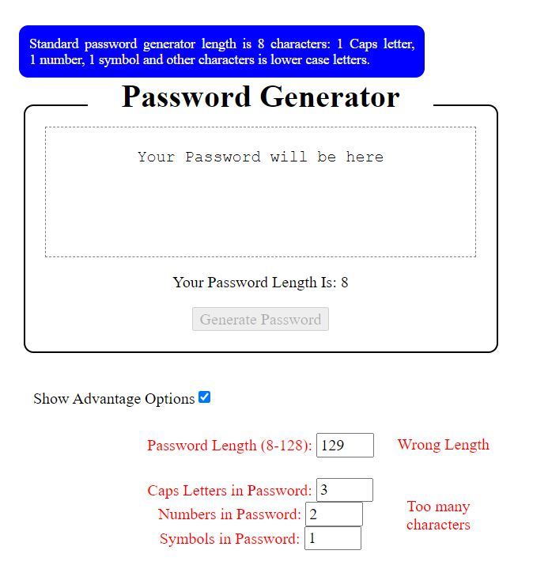

# 03-JavaScript-Password-Generator

Generates random passwords based on criteria that user selects.

Standard password length is 8 characters: 

1 Caps letter, 1 number, 1 symbol and other characters is lower case letters.

When the button to generate a password is clicked, then the standart password is generated.

If "Show Advantage Options" is selected:

It gives users to select password length and chose other number of characters in the password.

A password is generated that matches the selected criteria.

Password is displayed in the page.

## Mock-Up
The following images shows the web application's appearance and functionality:

© 2021 Julius Markauskas